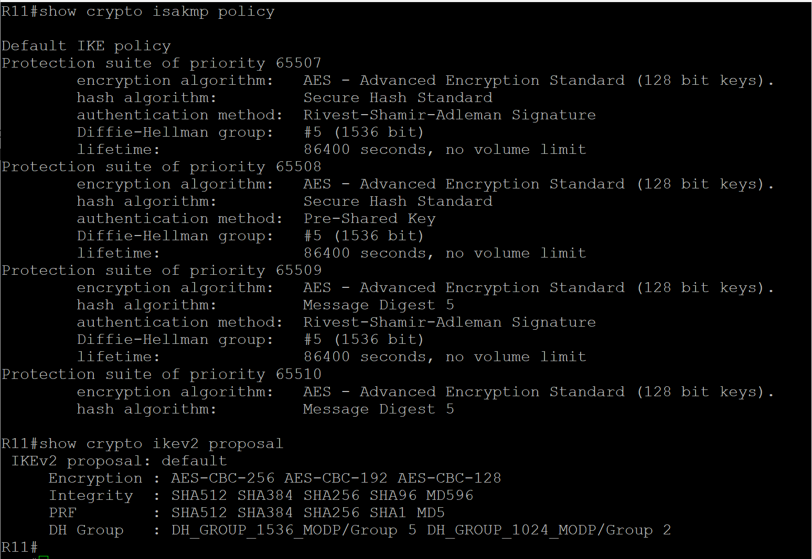
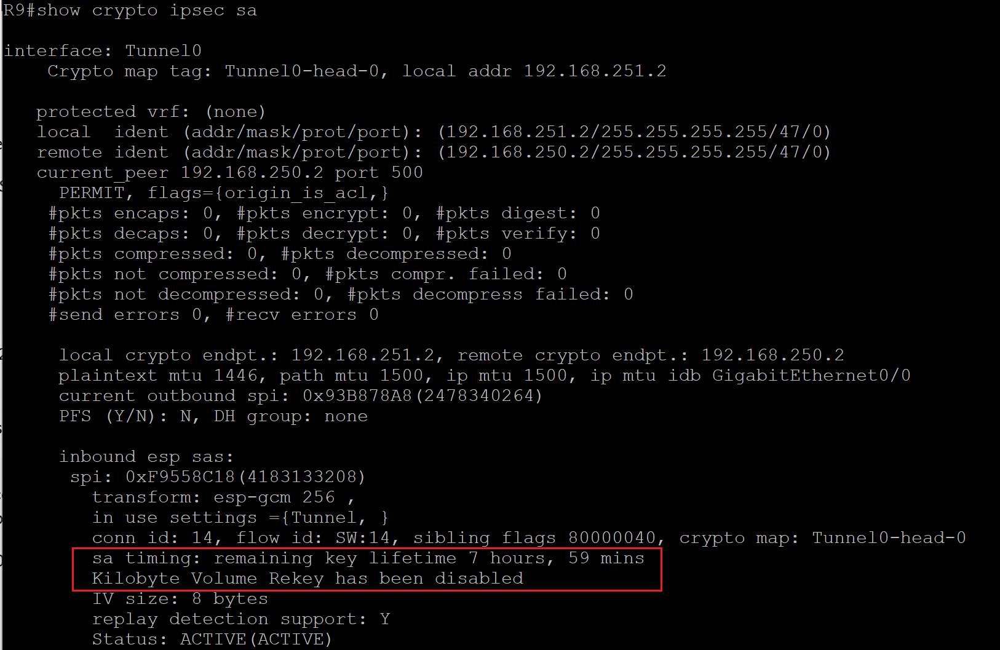
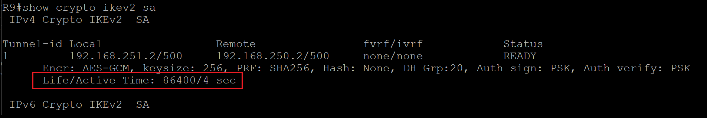

# Securing IOS-XE IPSec VPNs
This post provides some guidelines in securing an IPSec VPN on a Cisco IOS-XE router to reduce the attack surface when acting as a VPN gateway.

## Disable default crypto policies/proposals
As default Cisco IOS-XE routes come with default crypto IKEv1/ISAKMP policies, IKEv2 Proposals and IPSec Transform Sets to aid the deployment of a VPN, on old software versions these crypto ciphers are now considered weak and insecure. An administrator should disable the default settings and define new settings using only the strongest crypto ciphers. Leaving the default ISAKMP/IKE and IPsec policies enabled creates a vulnerability known as a downgrade attack, where a malicious user only offers weak cryptography suites and forces the VPN endpoints to negotiate non-compliant cryptography suites.

<p align="center">
  
</p>
 
The default crypto settings can easily be disabled using the following commands:  
```ruby
no crypto ipsec transform-set default
no crypto ipsec profile default
no crypto ikev2 policy default
no crypto ikev2 proposal default
no crypto isakmp default policy
```

Custom IKE/IPSec settings should be explictly defined using the most secure crypto ciphers, below is an example of an acceptable IKEv2 Proposal and IPSec transform set.
```ruby
crypto ikev2 proposal IKEV2-PROPOSAL
 encryption aes-gcm-256
 prf sha256
 group 20
!
crypto ikev2 policy IKEV2-POLICY
 proposal IKEV2-PROPOSAL
!
crypto transform-set TSET esp-gcm 256
```
## Key Lifetimes
Use the recommended key lifetimes, for IKE SA of 86400 seconds/1 day (default) and for Child SA/IPSec SA 28800 seconds/8 hours, Cisco also recommends to also disable SA lifetime based on kilobytes transmitted (relying only on the lifetime in seconds). Below is an example of the Child SA/IPSec SA lifetime configuration.
```ruby
crypto ipsec profile IPSEC-PROFILE
 set security-association lifetime seconds 28800
 set security-association lifetime kilobytes disable
```
<p align="center">
  
</p>

The default IKEv2 SA lifetime is 86400 and is not displayed in the running-configuration, to reduce to a short lifetime this can be configured under the IKEv2 Profile, example below.
```ruby
crypto ikev2 profile IKEV2-PROFILE
 lifetime <value>
```
<p align="center">
  
</p>
## Mitigate DoS attacks
When using FlexVPN the IKEv2 Cookie Challenge is used to mitigate against DoS attacks. When a VPN responder detects a large number of half-open IKE SAs to replies with a stateless cookie and only when the initiator relects the cookie back does it proceed with the IKEv2 negotiation.
```ruby
crypto ikev2 cookie-challenge <value>
```
## Limiting IKE and ESP (IPSec) to known hosts
As default the VPN concentrator is open to the internet and susceptible to network scanning, brute force attacks and zero-day vulnerabilities. To mitigate many of these vulnerabilities, an ACL can be implemented to restrict traffic the required ports (udp/500, udp/4500 and esp) to known peers only. Below is an example of an ACL to apply to the internet facing interface.
```ruby
object-group network VPN-PEERS
 host 1.1.1.1
 host 2.2.2.1
ip access-list extended SECURE-VPN
 remark ** Allow IKE/ESP/NAT-T from known hosts **
 permit udp object-group VPN-PEERS host 5.5.5.2 eq 500
 permit udp object-group VPN-PEERS host 5.5.5.2 eq 4500
 permit esp object-group VPN-PEERS host 5.5.5.2
 remark ** Deny IKE/ESP/NAT-T from unknown hosts **
 deny udp any any eq 500
 deny udp any any eq 4500
 deny esp any any
 remark ** Permit all other traffic **
 permit ip any any 
interface gigabitethernet 0/0
 ip access-group SECURE-VPN in
```
